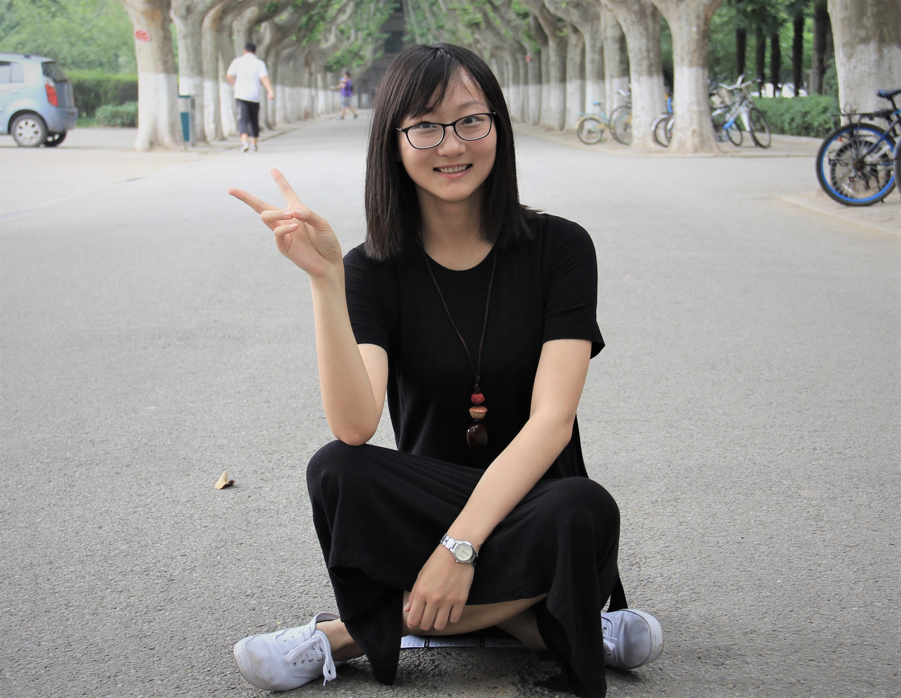

# About Myself

I am a master student at UC Davis in the Statistics department. Before this I was an undergraduate student at [Xi'an Jiao Tong University](http://en.xjtu.edu.cn/) in the Mathematics and Statistics Department. I hold a Bachelor degree in Mathematics from Xi'an Jiao Tong University. I do not have specific researches now but I feel machine learning is interesting. 

I am from China and my hometwon is Xi'an. It is a city with rich culture and many historical sites. It is the starting point of the Silk Road and home to the [Terracotta Army](https://en.wikipedia.org/wiki/Terracotta_Army) of [Emperor Qin Shi Huang](https://en.wikipedia.org/wiki/Qin_Shi_Huang). It is an amazing place and is worthy to have a look. Welcome to Xi'an!
# About 141B
In this course, students learn the concepts and gain experience in using fundamental technologies for data sciences.
## Some topics in class
## Project
